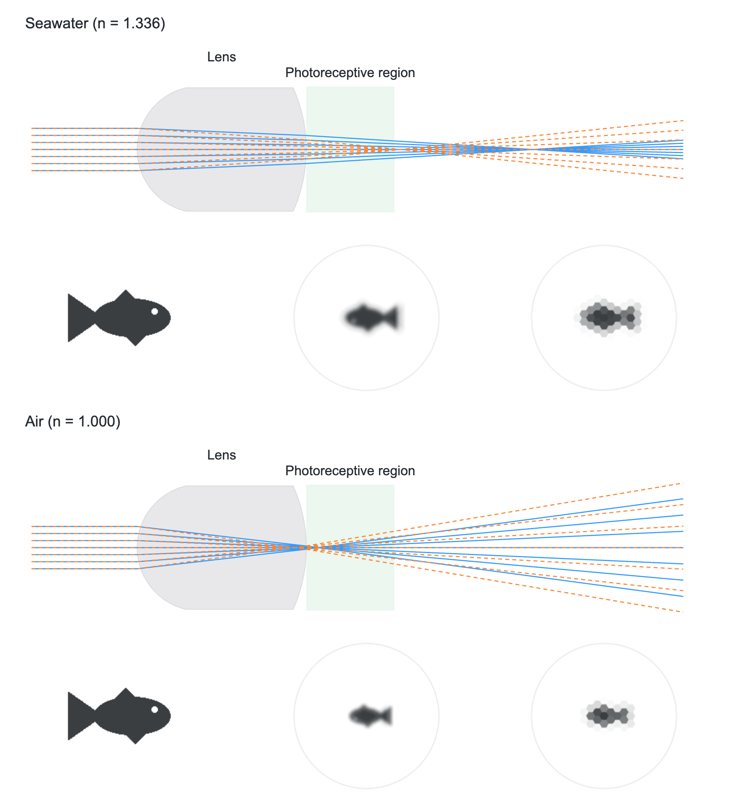

# 西印度石鳖的文石眼光路模拟

**Acanthopleura granulata — Visual light trace**



图的第一、三行为海水/空气中的双通道近轴光路；第二、四行从左至右是输入鱼形、接收面连续光强、理想六角采样。蓝色实线对应 n=1.53，橙色虚线对应 n=1.68。绿色阴影是约 0–25 µm 的感光区轴向参考范围，不是平面视网膜的实测边界。接收面固定在后顶点 +12.5 µm；光线继续传播，不被虚拟接收面吸收。图中只显示轴上物点的代表性光束。

## 运行交互演示

下载仓库后，直接用浏览器打开 `index.html`。无需服务器、API 密钥或网络访问。支持近轴 ABCD、球面 Snell 追迹、双标量通道叠加，以及鱼形、条纹、棋盘和点光源。参数保存在浏览器本地；图版重建脚本会显式设置参数，不依赖保存状态。

## 重建四行组合图

需要 Node.js 20 或以上版本。

```bash
npm install
npx playwright install chromium
npm run reproduce
```

输出：`chiton-water-air-plate.png`（1864 × 2064）和 `.svg`。SVG 的光路和文字为矢量，光强及采样图为内嵌位图。无随机噪声；圆形孔径使用固定的 80 点黄金角采样。Aptos 为可选本地字体；不随仓库分发。使用已安装 Aptos 字体可保持报告字形，否则回退到 Arial/sans-serif。可通过 `CHITON_APTOS_FILE` 指定自己合法持有的字体文件；不要将该字体文件或包含嵌入字体的 SVG 提交到公开仓库。

若使用已安装的 Chrome，可设置 `CHITON_BROWSER_CHANNEL=chrome`。图中含两通道等权强度叠加；它们不是严格双轴晶体本征模式的求解结果。

## 数据与参数来源

| 参数 | 数值 | 来源与性质 |
|---|---:|---|
| 前/后曲率半径 R1/R2 | +18 / −43 µm | Speiser et al. (2011) 的简化厚透镜几何 |
| 透镜厚度 t | 48 µm | 同上；不可与 Li et al. (2015) 不同透镜几何混用 |
| 外介质折射率 | 海水 1.336；空气 1.000 | 2011 模型设置 |
| 内介质折射率 | 1.336 | 2011 模型设置 |
| 两标量透镜折射率 | 1.53 / 1.68 | 2011 近似；不是完整双轴晶体的方向依赖折射率 |
| 感光区轴向参考范围 | 后顶点附近起约 0–25 µm | Speiser et al. (2011), Fig. 4C–D；近似解剖参照 |
| 接收面 | 后顶点 +12.5 µm | 本报告选取参考区间中心；非实测平面视网膜 |
| 孔径直径 | 12 µm | 演示设定，不是实测瞳孔直径 |
| 六角采样中心间距 | 4 µm | 为显示轮廓而设；文献感光细胞宽度约 7 µm，不能据此声称真实分辨率提高 |
| 目标/接收视野 | 48° / 80 µm 方形场 | 演示设置；接收图以半径 37.6 µm 圆形裁剪 |
| 鱼形输入 | 程序生成的轮廓函数 | 合成刺激，不来自论文原图或动物记录 |

本项目没有采集或重新分发原始 μ-CT、组织学、行为学或神经数据；只有文献参数、合成刺激和模型输出。Li et al. (2015), Fig. 3B 提供了“物体—成像—采样”这一展示思路；其 L2 下方焦距与本项目后顶点坐标不能直接相加比较。

## 模型与局限

使用光线向量 `(y, nθ)`，折射矩阵 `S(n1,n2,R)=[[1,0],[-(n2-n1)/R,1]]`，传播矩阵 `T(d,n)=[[1,d/n],[0,1]]`。厚透镜矩阵为 `M=S(nl,ni,R2) T(t,nl) S(ne,nl,R1)=[[A,B],[C,D]]`，后焦距 `BFL=-ni*A/C`。接收面落点为 `(A+d*C/ni)y0+(B+d*D/ni)ne*θ0`。

轴上孔径落点构成几何点扩散函数，通过对目标作角度映射与有限采样平均得到强度图，再进行六角单元局部平均。球面模式使用矢量 Snell 定律追迹，图像采用轴上 PSF 的局部平移不变近似。当前不含衍射、散射、Fresnel 损耗、真实晶轴取向、神经处理、感光器噪声或完整的三维视网膜。

文石是双轴晶体；**1.53/1.68 不应直接标为精确的 e/o 光线**。空气中高折射率通道的负后焦距不代表后表面外存在实焦点。模型不能证明双折射对双介质视觉的适应性，也不能证明两介质下均有焦点严格位于 0–25 µm 参照区间。

## 验证

```bash
python3 chiton_abcd.py
npm test
```

近轴后焦距（µm，顺序 n=1.53 / 1.68）：空气 `3.42 / −2.85`；海水 `64.25 / 26.67`。自动化测试检查这些基准、介质切换、接收面变化、图案变化与孔径对球差的影响。

## 文献

- Speiser, D. I., Eernisse, D. J., & Johnsen, S. (2011). A chiton uses aragonite lenses to form images. *Current Biology, 21*(8), 665–670. https://doi.org/10.1016/j.cub.2011.03.033
- Li, L., Connors, M. J., Kolle, M., England, G. T., Speiser, D. I., Xiao, X., Aizenberg, J., & Ortiz, C. (2015). Multifunctionality of chiton biomineralized armor with an integrated visual system. *Science, 350*(6263), 952–956. https://doi.org/10.1126/science.aad1246

所有模型图均为本项目计算输出；不在此仓库重新分发论文图版、报告原稿或商业字体。尚未指定软件许可证；公开可见不等于授予额外再许可权利。
